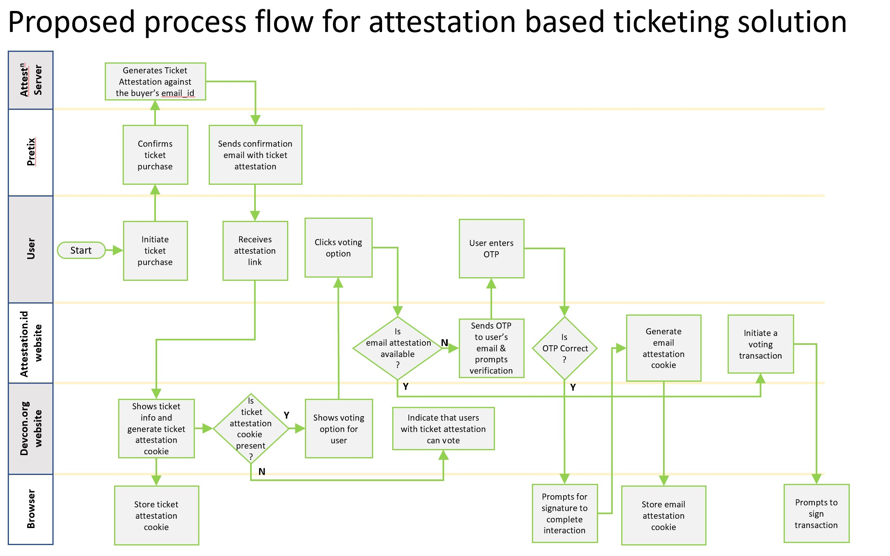

## Summary of Proposal
Implement an attestation based ticketing system on Ethereum for Devcon. The solution will use two attestations, ticket attestation in conjunction with email attestation, to verify authenticity of a ticket holder for both on-chain and off-chain use cases. This system will function independantly of Pretix solution. 

## Abstract

At the time of ticket purchase, Devcon issues the event attendees a ticket attestation in the ticket confirmation email, along with the traditional QR code generated by Pretix ticketing solution. This ticket attestation will be shared in the email as an URL, pointing to a ticket webpage where the attestation would be converted and stored into the browser cache as a cookie. The attestations will link every ticket to the respective email addresses of every attendee. At the same time, the QR code that is shared in the ticket confirmation email, or a ticket webpage, will continue to serve as the traditional ticket.

This ticket attestation will be recognised by websites and Dapps that use the attestation libraries provided by AlphaWallet team. Using the ticket attestation along with the correct email attestation, the websites and dapps will be able to authenticate ticket holders and provide previlaged access to content or actions. This means that the solution will enable Devcon attendees to use any smart contract based functions provided by Devcon or its partners, such as voting or buying exclusive products and services. It's worth noting that the attendee does not need to send an "enabling" Ethereum transaction, as a must, to start using his or her ticket as a crypto-token.

This approach is presents a cost-effective path, for both Devcon as well as the attendees. It is also a flexible solution, allowing the attendee to acquire an Ethereum address before or after the ticket purchase or to use their choice of Ethereum address for online interactions. To add on, this approach is also privacy-perserving. Through elliptic cryptography and zero-knowledge proof we have protocol [safe protocol](https://github.com/AlphaWallet/blockchain-attestation/blob/master/use-cases/send-ether-by-identifier-attestation.md) to enable attestations for an email address without revealing it.

## Motivation & Rationale

Many crypto users have only used crypto tokens as crypto currencies or as virtual collectables. We are strong believers in the future where crypto tokens would be the most obvious choice to connect the rights and services in digital and physical worlds.

Tickets are one of the best use cases to demonstrate how blockchain and crypto tokens can be used for real world use cases. The proposed blockchain solution is not only as cheap and as fast as the current system, but also provides a host of features that cannot be provided by traditional tickets. These crypto tokens can:

- Facilitate a frictionless secondary market, according to the smart contract rules
- Eliminates ticket fraud
- Offer limitless integration with host of services

Also the solution can convert non-crypto users to Ethereum users, as attendees can use the issued ticket (attestation #1) as an Ethereum token. If we can maintain and open up the system to other event organisers, it will bring us millions of new Ethereum users. Currently, there are 940 million unique digital ticket holders globally. If we can convert 5%, it is 47 million which is half of the total Ethereum unique addresses we have got for the past 5 years. 
      
## Implementation

The core modules of the smart contract based ticketing system is already implemented by the AlphaWallet for prior projects such as [FIFA 2018](https://alphawallet.com/for-business/case-study-tickets/) and UEFA 2020. 

The key peices of work that needs to be done include:
- Integrating ticket attestation generation to ticket purchase confirmation (attestation generator component would be created by AlphaWallet, integration to email attestation needs to be implemented by Devcon team)
- an email attestation service
- Attestation javascript components for websites
- Attestation libray for smart contracts
- Email attestation service 

WIth regards to the email attestation service (AlphaWallet) can create one such service for attendees to claim attestation #2 (explained below) at http://attestation.id, ideally to create a decentralised ecosystem of attestors for the benefit of enriching smart contract functions and reducing on-chain transactions. These attestations can be reused.

### Storyboard ###

### Attestations ###

Attestation based ticketing ensures privacy, flexibility and cost efficiency for the blockchain implementation of ticketing. It involves two attestations:

Attestation #1
: Attestation linking ticket with an email address (provided by ticketing system at the time of purchase of the ticket).

Attestation #2
: [for crypto users] Attestation linking Ethereum address with email address (acquired by the user through a DApp browser).

 
Attestation #1 is the "traditional ticket". It is issued by email after the payment is confirmed on the ticket purchasing website as QR code and [magic link](http://docs.tokenscript.org/MagicLinks.html). User is not required to have an Ethereum address at this stage.

Attestation #2 can be issued by http://attestation.id The process of acquiring attestation #2 would be a simple guided process for the users. It will be through visiting a website, where the user verifies their email to receive an attestation that will be saved in the Dapp browser as a cookie or in the user's wallet if the wallet can recognise attestations.
 
When the user wishes to interact with a smart contract function, such as voting, the user will call the smart contract with the attestation #1 and #2. Together they prove that the transaction sender's Ethereum address is that of the valid attendee. Such an implementation would preserve the privacy of the user, as these attestations do not reveal the actual email address. Please check out the [safe protocol](https://github.com/AlphaWallet/blockchain-attestation/blob/master/use-cases/send-ether-by-identifier-attestation.md) for more details.

Furthermore, a ticket ownership proof can be generated from [TokenScript](http://docs.tokenscript.org/) that allows a website to recognise Devcon ticket holders. This is useful for ticket holders to book services or to apply a discount. We can create a sample website for service providers to copy.

### Process Flow ###
The attached swimlane diagram shows how the different actors and parties invloved in the ticketing process would use the solution to prove and verify ticket's authenticity to provide previlaged access.

**Integration with Pretix**
- No integrations to Pretix solution, as per the latest designs. The current app for Pretix ticket check-in will continue to be used as it is.

**Previous implementations**

Our first ticket implementation was in 2018, as an experiment with FIFA officials to tokenise FIFA World Cup 2018 VIP tickets. The experiment was successful, where 50 users received attestation links through email and 28 of them converted those attestations into Ethereum tokens.

The next full fledged implementation was in 2019, with Shankai Sports for tokenising EURO Championship 2020 VIP event tickets, with integrated hospitality passes([App](https://apps.apple.com/us/app/shankai/id1492559481). The tickets were tokenised and the apps were ready to go, but the event got cancelled 😭😭😭)

In 2019, we also worked towards implementing EDCON 2020 event tickets on blockchain. Again, the app and tickets were ready, but thanks to the pandemic, the event got cancelled 😭😭😭)   

## Operational Requirements & Ownership
**Actions required to implement the proposal at Devcon**

1. What actions are required to implement the proposal at Devcon?

Development:
- Improving our existing attestation and smart contract based ticketing system
- Optimizing features for Devcon
- Ticket smart contract development and deployment
- Devcon Dapp website development
- Example webpages and Dapps to help implement the components 
- Initial testing and feedback (before event)
    
Operations for the event should be more or less the same as the previous Devcon. Tech support would be needed for people who are trying out the new experiences would be needed.

2. Who will be responsible for the proposal to be implemented effectively? (i.e. working on Day 0)

AlphaWallet and the Devcon team will be responsible for the implementation. The project governance would be done through weekly or fortnightly meetings managed in an Agile fashion. 

**Deliverables and Ownership:**
|#  | Deliverable | Description | Owner|
|---|-------------|-------------|------|
|1.|Devcon ticket Attributes |<ul><li>All the attributes that define a ticket</li></ul>|Devcon|
|2.|Attestation Modules |<ul><li>Library for websites to handle attestations, which are available as a cookie in the browser</li><li>The websites created by Devcon and other 3rd parties who want to verify a valid Devcon ticket holder will need to incorporate this library into their website.</li></ul>|AlphaWallet|
|3.|Attes.sol library |<ul><li>Library for smart contracts to handle attestations, for verifying a valid ticket holder</li></ul>|AlphaWallet|
|4.|Library documentations |<ul><li>Documentation for both TS_Attestation.js and Attes.sol libraries</li></ul>|AlphaWallet|
|5.|Attestation.id website |<ul><li>The website that sends OTP to verify user’s email ID and generates email attestation. </li></ul>|AlphaWallet|
|6.|Example Webpage: Ticket Issuer webpage |<ul><li>A sample website which shows just the ticket details and generate ticket attestation cookie to be stored in user’s browser </li></ul>|AlphaWallet|
|7.|Example Dapp: Simple Dapp using  attestations |<ul><li>A simple example distributed application to demonstrate how to implement attestation verification and uses a placeholder smart contract</li></ul>|AlphaWallet|
|8.|Ticket Attestation generator |<ul><li>Java component for creating links for ticket attestation</li></ul>|AlphaWallet|
|9.|Ticket Attestation Email routine |<ul><li>Use the ticket attestation generator component to create attestations and incorporate it into ticket confirmation emails</li></ul>|Devcon|
|10.|Devcon Ticket Page |<ul><li>The actual webpage that ticket attestation link directs user to </li></ul>|Devcon|
|11.|Devcon Dapps |<ul><li>The Dapps that allow users to vote, generate NFT etc based on ticket verification</li></ul>|Devcon|
|12.|Third Party Dapps |<ul><li>Any other services that may be offered by the community, for valid ticket holders.</li></ul>|Respective third party teams|

---

3. What other projects could this proposal be integrated with? (Bonus points for collaboration across teams :))

Any services which require to verify attendees, like a discount for products, redeemable vouchers, content unlocking, IoT(open door, control screen), collateral for DeFis and etc.

The [CO2ken project](https://forum.devcon.org/t/co2ken-carbon-neutral-devcon/27) is an ideal team to collaborate with and to integrate their proposal (DIP-1) to provide attendees the choice of offesting some of the carbon emissions caused by the event. This functionality can be added to the Devcon DAPP website and any users using the website can support the cause by donating tokens to CO2ken

## Links & Additional Information

**Possible Questions**
1. Can the Tickets work without internet?
A. Yes, the ticket can be used to check-in with out internet. This was one of the key requirements for the implementations for FIFA and UEFA. However, internet will be needed to access the advanced DAPP features offered by the ticket such as voting.

2. tbc

**Links**
* [Link to Devon Forum — Attestation based Ticketing solution DIP](https://forum.devcon.org/t/attestation-based-ticketing-system-that-is-managed-by-ethereum-smart-contracts-and-integrated-with-pretix-re-rfp-1-onchain-ticketing/54)
* [AlphaWallet website](https://alphawallet.com/)
* [FIFA Tickets case study](https://alphawallet.com/for-business/case-study-tickets/)
* [Pretix Solution GitHub](https://github.com/pretix/pretix)
* [AlphaWallet GitHub](https://github.com/AlphaWallet)
